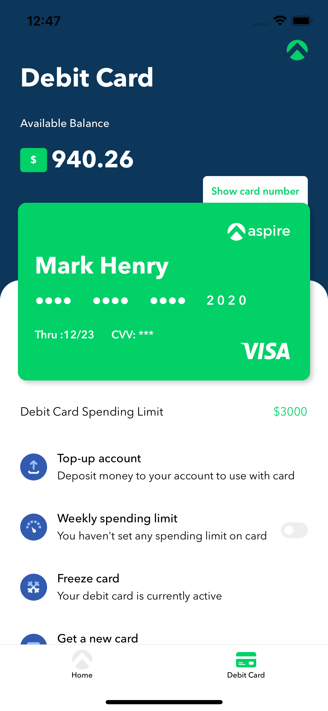
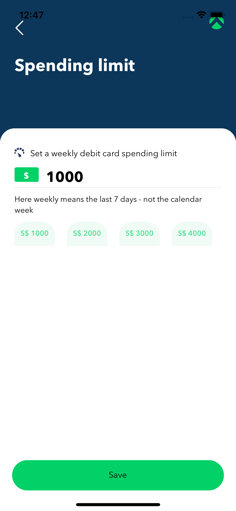
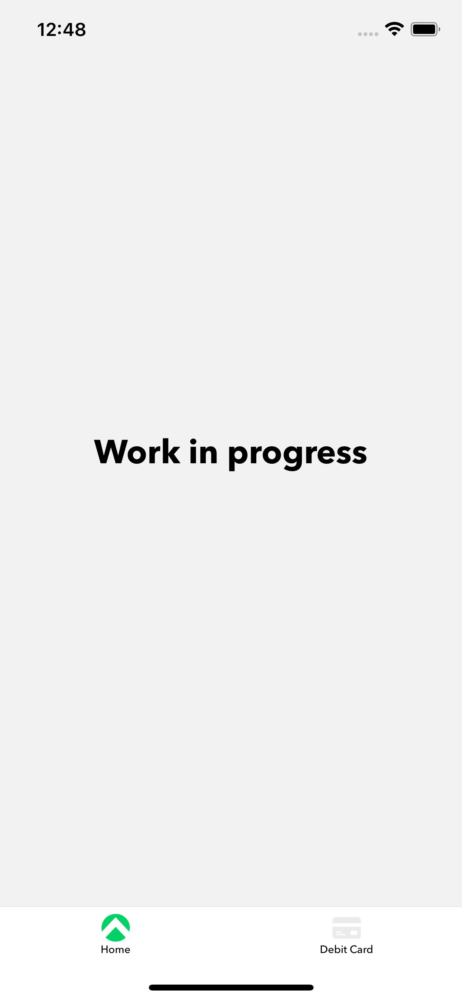

# Assignment 
Debit Card Implementation written in Bare React Native.

## Get started
* clone https://github.com/trinadhkoya/aspire
* go to root folder of project and run the command `yarn install`
* if you are on Mac M1, run `yarn pod` which will help you to install pods on your iOS
* finally run `yarn ios` to see the demo in action

### Covered and WIP:
1. Home Page‍✅
2. Debit Card Section ✅
3. Spending Limit ✅
4. Redux Saga✅
5. Mock API✅
6. Make the calls to a mock API server to return dummy data ✅

### Back End (Mock API related):
MockAPI is a simple tool that lets you easily mock up APIs, generate custom data, and preform operations on it using RESTful interface. MockAPI is meant to be used as a prototyping/testing/learning tool.

[https://mockapi.io]()

#### Screenshots

<table>
  
  <tr>
    <td></td>
    <td></td>
    <td></td>
  <tr>
  <tr>
    <td></td>
    <td></td>
  <tr>

</table>

##### NOTE
I have not tested this on android for time being. Please let me know if in case if you find any issues

###### Author:
trinadhkoya

Portfolio: <a href='https://trinadhkoya.dev'>trinadhkoya.dev</a>
<td>

</td>
